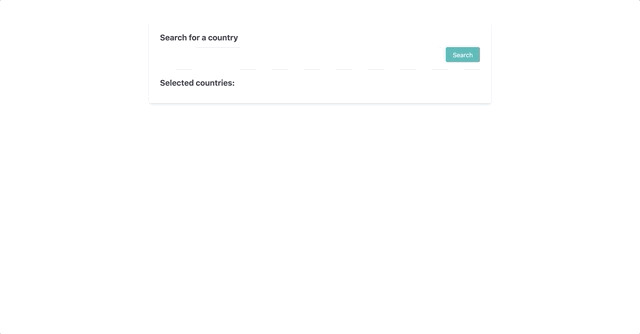
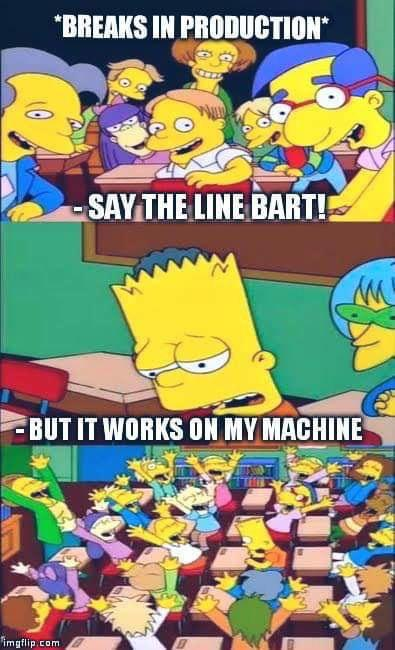

# Currency converter

## Overview

This is a currency converter web application which allows you to select countries, input an amount in SEK and convert it to each country's currency.

## Try it out!



You can try the app online [https://priceless-kilby-bee307.netlify.app/](https://priceless-kilby-bee307.netlify.app/) or just follow the installation steps.

### Installation

To run this app locally, you'll need to have Docker installed and perform the following steps:

Clone this repository.

```
git clone https://github.com/MiguelGT98/currency-conversion.git
```

After doing that, move into the newly created folder.

```
cd reponame
```

Now, install dependencies on the host machine for both the api and client directories.

```
cd api && yarn install && cd ..
```

```
cd client && yarn install && cd ..
```

Look for the docker-compose.yml file and fill in the required environment variables under the api service (Lines 18 and 20).

```
    api:
    ...
        environment:
            COUNTRY_API_ENDPOINT: "https://restcountries.eu/rest/v2"
            CURRENCY_API_ENDPOINT: "http://data.fixer.io/api"
            CURRENCY_API_KEY: "YOUR_API_KEY_HERE"
            PREFERRED_CURRENCY_CODE: "SEK"
            SECRET: "YOUR_SECRET_HERE"
            REDIS_URL: "//redis:6379"
    ...
```

Build and run the containers using docker-compose.

```
docker-compose build && docker-compose up
```

After doing the previous initial setup, you don't need to build the containers again, you can just start the app by running.

```
docker-compose up
```

## Why use docker?

I chose to use Docker in order to avoid common problems with environment replication and issues with making things work on different machines.



## API

API was built using Node.js and the Express library. For more details, refer to api's [README.md](./api/README.md)

## Client

Client was built using React and bootstrapped with create-react-app. For more details, go to client's [README.md](./client/README.md)

## Time distribution

Before starting the project I set myself up on spending less than 6 hours in this project, and to make sure I spent my time properly I logged all the time spent working on this using Toggl Track.

If I had more time for this assignment I would definetly add a few functionalities to make it easier for the user to use it:

1. The ability to define the prefferred currency to convert from. This would result in changes in both the API (Maybe add another query parameter on the countries endpoint) and the Client.

2. I would have loved to implement tests for rate limiting. However, I wasn't able to do so since it was a bit complex to do and I had to properly spend my time on other things.

3. Proper API documentation: My API endpoint documentation was quite simple and did not properly cover everything that it should. So if given more time, I would have gone into more details.

4. In my opinion, I did not properly show my CSS skills, since I used an amazing front end framework (Tailwind CSS) that reduces a lot of development time. So if given more time, I would have definitely done some more custom CSS.

### Api (2hr. 46 min. 25 sec.)

#### Planning

10 min. 23 sec.

#### Development

1 hr. 42 min. 41 sec.

#### Tests

27 min. 10 sec.

#### Documentation

26 min. 11 sec.

### Client (2hr. 55 min. 1 sec.)

#### Planning

6 min. 49 sec.

#### Development

2 hr. 10 min. 37 sec.

#### Tests

22 min. 35 sec.

#### Documentation

15 min. 00 sec.
