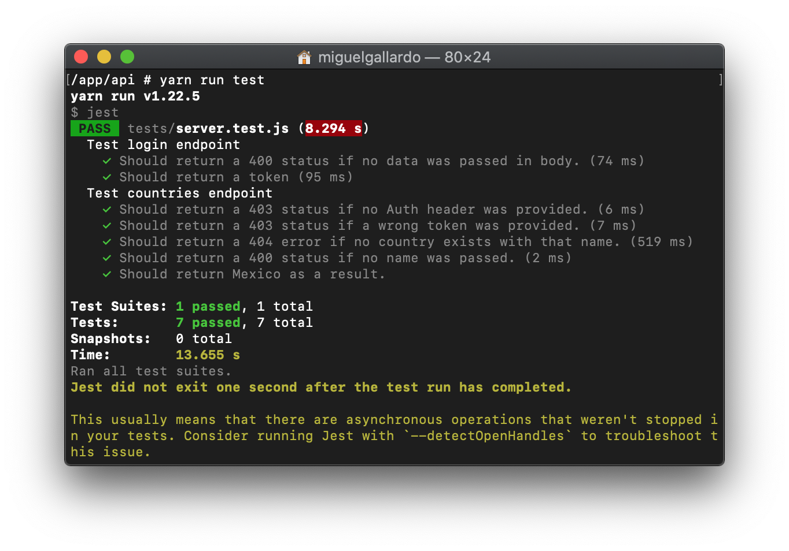

# API

## Overview

This is the REST API for a currency converter project.

## Example

To see a running example of this API, visit: [https://peaceful-wildwood-04873.herokuapp.com/](https://peaceful-wildwood-04873.herokuapp.com/)

## Third party libraries

All of the libraries used in this API are Open Source and provide clear benefits over doing everything on my own.

### Express

Provides good abstractions for spinning up a web server and is one of the go to packages when creating an API using Node due to it's popularity (Stack Overflow is flooded with questions :)) and good documentation.

### Cors

Library used for solving any CORS error we might run into.

### Redis

It's basically a super performant in-memory data structure that I can make use of to store information about user's requests (rate limiting is done using this library) and it's node implementation is really good.

### jsonwebtoken

This library exposes certain functions for working with JWTs.

### nodemon

This package is used in our start script, watches any file changes and reloads our application so we don't have to.

### node-fetch

An implementation of fetch used to make GET requests to the APIs.

### Jest and supertest

Test libraries used to test API endpoints.

## Code structure

Code is divided in five main directories. Models, Controllers, Routes, Middlewares and Tests. This allows for a proper code organization and prevents problems when trying to update or add new features.

### Models

In here lies all the code that communicates with external services.

### Controllers

Functions for handling HTTP requests. Makes use of the Model to return a proper response to the request.

### Routes

In this folder I define all of the routes that a resource will have. Uses both controllers and middlewares.

### Middlewares

Middlewares to provide extra functionality like token validation for routes or rate limiting.

### Tests

There are some tests written under the tests directory to make sure the API works correctly. These tests can be run from the container terminal by using the following command:

```
yarn run test
```



## Endpoints

This api exposes two main endpoints. One for generating a JWT and another one to query for a country's data.

### Login

#### POST /login

Hit this endpoint with user details in the body or just some test (dummy) data like this:

```
{
    someKey: "someValue"
}
```

A sample response for a valid request will look like this:

```
{
    token: "a.valid.token"
}
```

### Country

#### GET /countries?name=country_name

Hit this endpoint with your search string replacing "country_name". An example would be something like this: **/countries?name=Mexico**.

You also need to provide the Authorization header with a string thats similar to the following:

```
{
    Authorization: "Bearer token"
}
```

Where token will be replaced by the token you got from a POST request to **/login**.

A sample response for a valid request will look like this:

```
{
    "countries": [
        {
            "currencies": [
                {
                    "code": "MXN",
                    "name": "Mexican peso",
                    "symbol": "$",
                    "rate": 0.41895711262647817
                }
            ],
            "flag": "https://restcountries.eu/data/mex.svg",
            "name": "Mexico",
            "population": 122273473
        }
    ]
}
```
